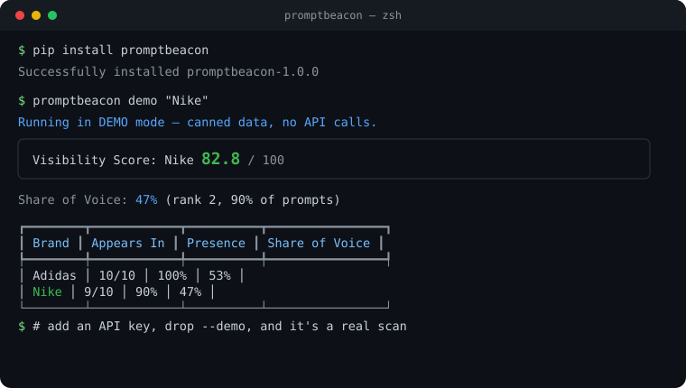
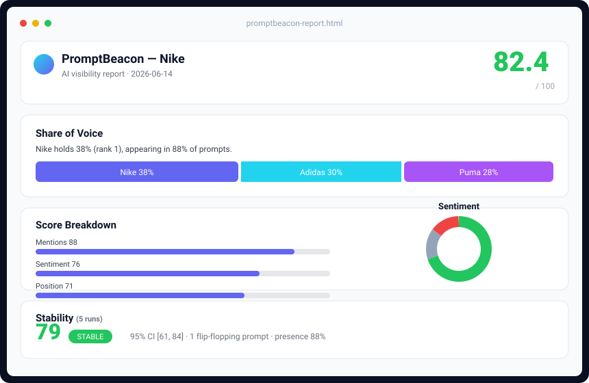

<p align="center">
  
</p>

<p align="center">
  <b>Does AI recommend your brand?</b><br>
  The open-source engine to <b>measure, track, and CI-test</b> your visibility across
  ChatGPT, Claude, Gemini, Mistral &amp; more. <code>pip install</code>, zero keys to start.
</p>

<p align="center">
  <a href="https://yotambraun.github.io/promptbeacon/"></a>
  <a href="https://pypi.org/project/promptbeacon/"></a>
  <a href="https://pepy.tech/project/promptbeacon"></a>
  <a href="https://github.com/yotambraun/promptbeacon/actions/workflows/ci.yml"></a>
  <a href="https://www.python.org/downloads/"></a>
  <a href="LICENSE"></a>
  <a href="https://codecov.io/gh/yotambraun/promptbeacon"></a>
</p>

<p align="center">
  <b>📖 <a href="https://yotambraun.github.io/promptbeacon/">Documentation</a></b>
  &nbsp;·&nbsp; <a href="https://yotambraun.github.io/promptbeacon/quickstart/">Quickstart</a>
  &nbsp;·&nbsp; <a href="https://yotambraun.github.io/promptbeacon/examples/">Examples</a>
  &nbsp;·&nbsp; <a href="https://yotambraun.github.io/promptbeacon/api-reference/">API Reference</a>
  &nbsp;·&nbsp; <a href="https://pypi.org/project/promptbeacon/">PyPI</a>
</p>

---

People used to Google "best running shoes" and click a link. Now they ask ChatGPT — and
get one synthesized answer with **no click**. If the AI doesn't mention you, you're
invisible. **PromptBeacon measures whether it does**, with the statistical rigor a real
monitoring pipeline needs — and you can run it in your terminal or your CI in 60 seconds.

## Try it now — no API keys

```bash
pip install promptbeacon
promptbeacon demo "Nike"
```

<p align="center">
  
</p>

`demo` runs against a realistic offline mock, so you see exactly what a real scan produces
without spending a cent. When you're ready, add an API key and drop `--demo`.

```python
from promptbeacon import Beacon

# Keyless: works the moment you install
report = Beacon("Nike").demo().with_competitors("Adidas", "Puma").scan()

print(f"Visibility:      {report.visibility_score}/100")
print(f"Share of Voice:  {report.share_of_voice.target_share:.0%} (rank {report.share_of_voice.target_rank})")
```

> [!TIP]
> Liked that? The **[documentation](https://yotambraun.github.io/promptbeacon/)** covers Share of Voice, stability scoring, smart mode, and wiring PromptBeacon into your CI — every example runs keyless. New here → [Quickstart](https://yotambraun.github.io/promptbeacon/quickstart/).

## Why PromptBeacon

The AI-visibility (GEO / AEO) space is dominated by **$29–490/month SaaS dashboards**
(Profound, Peec, Otterly…). They're built for marketers to *look at*. PromptBeacon is built
for developers and agencies to *build on* — the open-source measurement engine you can
script, schedule, embed in a product, or gate a deploy with.

|                          | SaaS dashboards            | **PromptBeacon**                       |
| ------------------------ | -------------------------- | -------------------------------------- |
| Price                    | $29–490+/mo, per seat      | **Free, Apache-2.0**                   |
| Where your data lives    | Their cloud                | **Your machine** (local-first)         |
| Try without paying       | Trial / credit card        | **`pip install` → keyless demo**       |
| Programmable             | Limited API                | **It's a Python library**              |
| Reproducibility          | One number                 | **Confidence intervals + stability**   |
| CI / regression testing  | ✗                          | **pytest plugin + GitHub Action**      |
| Providers in one run     | Tier-gated                 | **6, simultaneously**                  |

### Who it's for

- **Indie devs & technical founders** — "does ChatGPT recommend *my* product?", answered in code.
- **GEO/SEO agencies & consultants** — one engine, every client, build your own dashboards on top.
- **AI / eval engineers** — track brand visibility as a CI check next to your other evals.

## The three things that make it rigorous

### 1. Share of Voice — the metric everyone wants

Of all the brand presence across your prompt set (you + competitors), what fraction is yours?

```python
report = Beacon("Nike").demo().with_competitors("Adidas", "Puma").scan()
sov = report.share_of_voice
print(sov.target_share)        # 0.34  (34% share of voice)
print(sov.target_presence_rate)# 0.88  (appears in 88% of prompts)
print(sov.target_rank)         # 2     (rank by appearances)
```

### 2. Stability — don't trust a single answer

LLM answers are probabilistic: in the wild, only ~30% of brands stay visible from one answer
to the next. PromptBeacon repeats each prompt N times and tells you **how much to trust the
number** — a 0–100 stability score, a confidence interval, and which prompts flip-flop.

```python
report = Beacon("Nike").demo().with_stability(5).scan_stability()
s = report.stability
print(s.stability_score)            # 78.5  (higher = more trustworthy)
print(s.score_confidence_interval)  # (61.0, 84.0)
print(s.flip_flop_count)            # prompts that appeared in some runs but not others
```

### 3. CI-native — gate your deploys on AI visibility

No other tool lets you fail a build when AI stops recommending you.

```python
# In code
Beacon("Nike").scan().assert_visibility(min_score=50, min_share_of_voice=0.3)
```

```python
# As a pytest check (plugin auto-registers; skips cleanly without keys)
import pytest

@pytest.mark.visibility(brand="Nike", competitors=["Adidas"], min_score=40)
def test_brand_is_visible():
    ...
```

```yaml
# As a GitHub Action
- uses: yotambraun/promptbeacon@v1
  with:
    brand: "Nike"
    competitors: "Adidas Puma"
    min-share-of-voice: "0.3"
  env:
    OPENAI_API_KEY: ${{ secrets.OPENAI_API_KEY }}
```

## Shareable dashboard (no SaaS)

```bash
promptbeacon dashboard "Nike" --competitor "Adidas" --demo
```

<p align="center">
  
</p>

Writes a single, self-contained HTML file — Share-of-Voice bar, score breakdown, sentiment
donut, stability band — that you can hand to a stakeholder. No server, no subscription.
([sample](assets/sample-dashboard.html))

## Real scans (with keys)

```bash
export OPENAI_API_KEY="sk-..."          # https://platform.openai.com/api-keys
export ANTHROPIC_API_KEY="sk-ant-..."   # https://console.anthropic.com/settings/keys
promptbeacon providers                   # check what's configured
```

```python
from promptbeacon import Beacon, Provider

report = (
    Beacon("Nike")
    .with_aliases("Nike Inc", "Nike Corporation")       # count all name variants
    .with_competitors("Adidas", "Puma", "New Balance")
    .with_providers(Provider.OPENAI, Provider.ANTHROPIC)
    .with_industry("ecommerce")                          # industry-tuned prompts
    .with_cache()                                        # skip duplicate queries
    .with_storage("~/.promptbeacon/nike.db")             # track history over time
    .scan()
)

print(f"Score: {report.visibility_score}/100  |  SoV: {report.share_of_voice.target_share:.0%}")
for name, score in report.competitor_comparison.items():
    print(f"  {name}: {score.visibility_score:.1f}")
```

### Smart mode — LLM accuracy + actionable advice

Regex extraction is fast and offline, but heuristic. `--smart` (or `.with_smart_extraction()`)
uses a cheap LLM with structured output to read each response — catching paraphrases and
nuance regex misses — and `.with_smart_recommendations()` turns the scan's own data into
specific "why you're invisible and how to fix it" guidance. Opt-in (one extra LLM call each);
falls back to regex/rule-based on any error.

```bash
promptbeacon scan "Nike" -c "Adidas" --smart
```

## BeaconGuard: real-time brand safety (bonus)

Shipping a customer-facing AI chatbot? `BeaconGuard` flags when an LLM output recommends a
competitor or trashes your brand — **local, no API calls**.

```python
from promptbeacon import BeaconGuard

guard = BeaconGuard("Nike", competitors=["Adidas", "Puma"])
result = guard.analyze("Try Adidas instead — Nike has quality issues.")
print(result.risk_level)  # "high"
```

Works as middleware in any pipeline, or with LangChain (`pip install 'promptbeacon[langchain]'`).
See [Advanced Usage](docs/advanced.md#real-time-brand-safety).

## CLI

```bash
promptbeacon demo "Nike"                                  # keyless, instant
promptbeacon scan "Nike" -c "Adidas" -p openai -p anthropic
promptbeacon scan "Nike" --stability 5                    # repeat for a stability score
promptbeacon scan "Nike" --assert-min-score 50           # CI gate (exit 1 on fail)
promptbeacon dashboard "Nike" --demo                      # shareable HTML
promptbeacon compare "Nike" --against "Adidas"
promptbeacon history "Nike" --days 30
promptbeacon providers
```

## Features

| Feature | Description |
|---------|-------------|
| **Keyless demo mode** | `pip install` → realistic scan with zero API keys |
| **Smart mode (LLM)** | `--smart` swaps regex for LLM extraction + evidence-linked, actionable recommendations |
| **Share of Voice** | Presence-based SoV vs competitors, per-provider + aggregate + rank |
| **Stability scoring** | Repeat-N-times trust score, confidence interval, flip-flop detection |
| **CI-native** | `assert_visibility()`, pytest plugin, GitHub Action |
| **HTML dashboard** | Single-file, shareable, no SaaS |
| **6 LLM Providers** | OpenAI, Anthropic, Google, Mistral, Cohere, Perplexity — queried together |
| **Citation Tracking** | Which sources LLMs cite when discussing your brand |
| **Brand Aliases** | "Nike Inc", "Nike Corporation" all count as Nike |
| **Industry Templates** | ecommerce, SaaS, finance, healthcare, travel, food, tech |
| **Historical Tracking** | DuckDB-powered local storage for trends |
| **Score Breakdown** | See which of 4 factors drives your score |
| **5 Export Formats** | JSON, CSV, Markdown, HTML, pandas DataFrame |
| **BeaconGuard** | Real-time brand-safety guard for LLM outputs |
| **Local-First** | Your data stays on your machine — no cloud, no subscription |

## Supported Providers

| Provider | Default Model | Env Variable |
|----------|---------------|--------------|
| OpenAI | gpt-4o-mini | `OPENAI_API_KEY` |
| Anthropic | claude-haiku-4-5 | `ANTHROPIC_API_KEY` |
| Google | gemini-2.0-flash | `GOOGLE_API_KEY` |
| Mistral | mistral-small-latest | `MISTRAL_API_KEY` |
| Cohere | command-r | `COHERE_API_KEY` |
| Perplexity | sonar | `PERPLEXITY_API_KEY` |

## Documentation

📖 **[Full docs &amp; guides →](https://yotambraun.github.io/promptbeacon/)**

- [Quickstart](docs/quickstart.md) — up and running in 5 minutes (keyless)
- [Share of Voice &amp; Stability](docs/advanced.md) — the rigor features
- [CI &amp; pytest plugin](docs/examples.md) — gate deploys on AI visibility
- [API Reference](docs/api-reference.md) · [Providers](docs/providers.md) · [Storage](docs/storage.md)

## Development

```bash
git clone https://github.com/yotambraun/promptbeacon
cd promptbeacon
uv venv && uv sync --all-extras

uv run pytest --cov -v        # tests
uv run ruff check .           # lint
uv run ruff format .          # format
```

## Contributing

Contributions welcome! See [TODO.md](TODO.md) for the roadmap.

## License

Apache License 2.0 — see [LICENSE](LICENSE).

## Acknowledgements

Built with [LiteLLM](https://github.com/BerriAI/litellm), [Pydantic](https://docs.pydantic.dev/), [DuckDB](https://duckdb.org/), [Typer](https://typer.tiangolo.com/), and [Rich](https://rich.readthedocs.io/).
