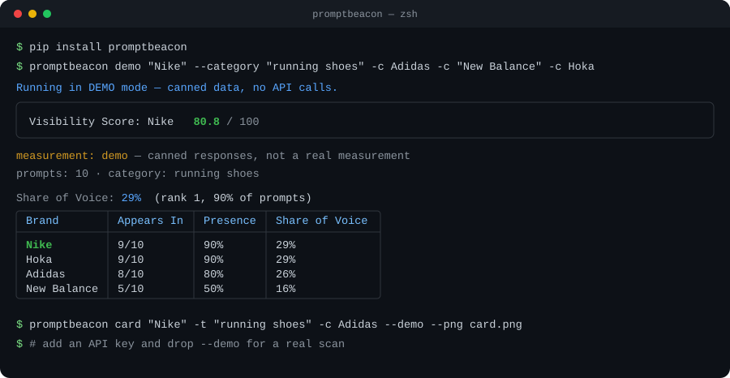
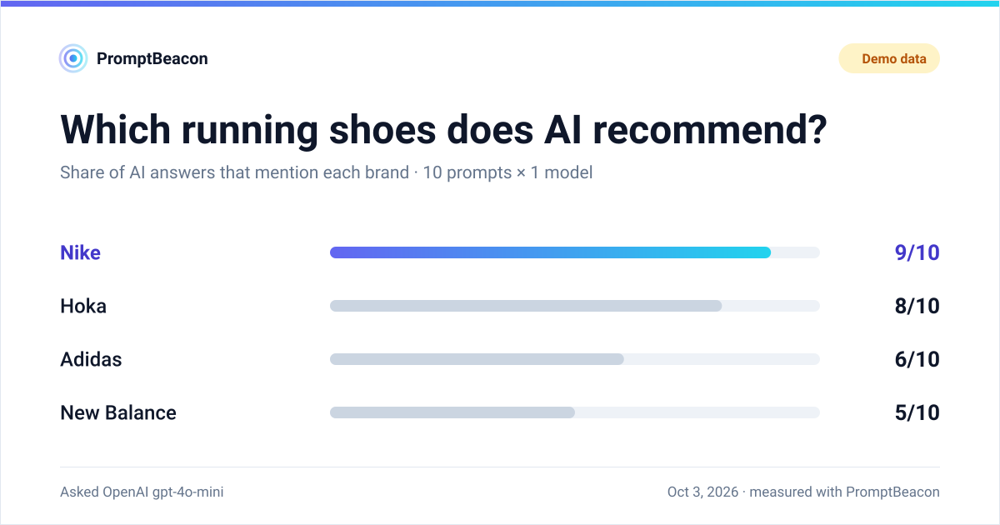
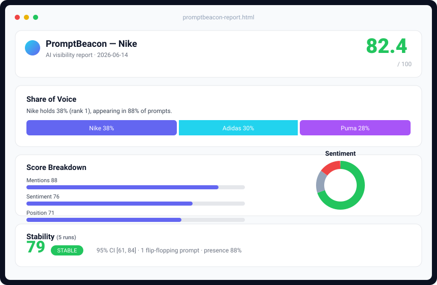

<p align="center">
  <picture>
    <source media="(prefers-color-scheme: dark)" srcset="assets/logo-dark.svg">
    
  </picture>
</p>

<p align="center">
  <b>Does AI recommend your product?</b><br>
  Measure, track and CI-test how often ChatGPT, Claude, Gemini and other assistants
  mention you, for brands and open-source projects alike. <code>pip install</code>, no keys needed to start.
</p>

<p align="center">
  <a href="https://yotambraun.github.io/promptbeacon/"></a>
  <a href="https://pypi.org/project/promptbeacon/"></a>
  <a href="https://pepy.tech/project/promptbeacon"></a>
  <a href="https://github.com/yotambraun/promptbeacon/actions/workflows/ci.yml"></a>
  <a href="https://www.python.org/downloads/"></a>
  <a href="LICENSE"></a>
  <a href="https://codecov.io/gh/yotambraun/promptbeacon"></a>
</p>

<p align="center">
  <b><a href="https://yotambraun.github.io/promptbeacon/">Documentation</a></b>
  &nbsp;·&nbsp; <a href="https://yotambraun.github.io/promptbeacon/quickstart/">Quickstart</a>
  &nbsp;·&nbsp; <a href="https://yotambraun.github.io/promptbeacon/projects/">Open-source projects</a>
  &nbsp;·&nbsp; <a href="https://yotambraun.github.io/promptbeacon/share/">Badges &amp; cards</a>
  &nbsp;·&nbsp; <a href="https://yotambraun.github.io/promptbeacon/mcp/">Claude Code &amp; MCP</a>
</p>

---

People used to search "best running shoes" or "best Python HTTP client" and click a link.
Now they ask an assistant and get one answer. If it doesn't mention you, you're not in the
running. **PromptBeacon measures whether it does**, with the repeat-and-measure rigor that
probabilistic answers need, from your terminal, your Python code, or your CI.

## Try it in 10 seconds, no API key

```bash
pip install promptbeacon
promptbeacon demo "Nike" --category "running shoes" -c Adidas -c "New Balance" -c Hoka
```

<p align="center">
  
</p>

The demo runs against an offline mock built from your inputs, so you see exactly what a
real scan produces without spending anything. Results are always labelled
`measurement: demo`. Add an API key and drop `--demo` for a real measurement.

Measuring an open-source project? Point it at the package or repository and PromptBeacon
reads the public metadata to pick the category and competitors:

```bash
promptbeacon scan --pypi httpx --demo          # or --repo encode/httpx, --npm express
```

## Share the result

One scan feeds a README badge and a 1200×630 card in light and dark (SVG, plus PNG for
networks that don't accept SVG):

```bash
promptbeacon scan "Nike" -t "running shoes" -c Adidas -f json > report.json
promptbeacon badge --report report.json --endpoint .promptbeacon/badge.json
promptbeacon card  --report report.json --theme both --png card.png
```

<p align="center">
  
</p>

<p align="center">
  <picture>
    <source media="(prefers-color-scheme: dark)" srcset="assets/card-dark.svg">
    
  </picture>
</p>

Both images above are real `promptbeacon` output from demo data, and say so. A
[weekly workflow template](examples/workflows/ai-visibility-weekly.yml) keeps a badge
current; see [Badges & share cards](https://yotambraun.github.io/promptbeacon/share/).

## In Python

```python
from promptbeacon import Beacon

report = (
    Beacon("Nike")
    .with_category("running shoes")
    .with_competitors("Adidas", "Puma")
    .demo()  # keyless; remove for a real scan
    .scan()
)

print(f"Visibility:     {report.visibility_score:.0f}/100")
print(f"Share of voice: {report.share_of_voice.target_share:.0%}")
print(f"Rank:           {report.share_of_voice.target_rank}")
```

The category is what makes a scan meaningful: prompts become real buyer questions such as
"What are the best running shoes?". Without one, PromptBeacon asks "alternatives to
&lt;competitor&gt;" questions when you give competitors, and otherwise warns you.
`.with_category_inference()` (CLI: `--infer-category`) can name the category with one
model call.

## Why PromptBeacon

The AI-visibility (GEO / AEO) space is mostly **$29–490/month dashboards** built for
marketers to look at. PromptBeacon is an open-source measurement engine for developers to
build on: script it, schedule it, embed it, or gate a deploy on it.

|                          | SaaS dashboards            | **PromptBeacon**                          |
| ------------------------ | -------------------------- | ----------------------------------------- |
| Price                    | $29–490+/mo, per seat      | **Free, Apache-2.0**                      |
| Where your data lives    | Their cloud                | **Your machine** (local-first)            |
| Try without paying       | Trial / credit card        | **`pip install` → keyless demo**          |
| Programmable             | Limited API                | **A Python library, CLI and MCP server**  |
| Reproducibility          | One number                 | **Confidence intervals + stability**      |
| CI / regression testing  | Rare                       | **pytest plugin + GitHub Action**         |
| Providers in one run     | Tier-gated                 | **6, queried concurrently**               |
| Measures live AI search  | Opaque / varies            | **Web-grounded, with real citations**     |
| Open-source projects     | Not a focus                | **`--repo` / `--pypi` / `--npm`**         |

### Who it's for

- **Maintainers and developer-tool teams**: "does ChatGPT recommend *my* library?", tracked over time.
- **Indie devs and technical founders**: your product's AI visibility, answered in code.
- **GEO/SEO agencies and consultants**: one engine for every client, your own dashboards on top.
- **AI and eval engineers**: brand visibility as a CI check next to your other evals.

## Measuring it properly

### Share of Voice

Of all the brand presence across your prompts (you plus competitors), what fraction is yours?

```python
report = (
    Beacon("Nike")
    .with_category("running shoes")
    .with_competitors("Adidas", "Puma")
    .demo()
    .scan()
)
sov = report.share_of_voice
print(sov.target_share)  # 0.41 -> 41% share of voice
print(sov.target_presence_rate)  # 0.9  -> mentioned in 90% of answers
print(sov.target_rank)  # 1    -> rank by appearances
```

### Stability: don't trust a single answer

Answers vary from one run to the next. PromptBeacon repeats each prompt N times and tells
you how much to trust the number: a 0–100 stability score, a confidence interval, and which
prompts flip-flop.

```python
report = (
    Beacon("Nike")
    .with_category("running shoes")
    .demo()
    .with_stability(5)
    .scan_stability()
)
s = report.stability
print(s.stability_score)  # 53.5 (higher = more trustworthy)
print(s.score_confidence_interval)  # (66.4, 82.1)
print(s.flip_flop_count)  # 8 prompts appeared in some runs but not others
```

### In CI: gate deploys on AI visibility

```python
Beacon("Nike").with_category("running shoes").scan().assert_visibility(
    min_score=50, min_share_of_voice=0.3
)
```

```python
# pytest plugin (auto-registers; skips cleanly without keys)
import pytest


@pytest.mark.visibility(
    brand="Nike", categories=["running shoes"], competitors=["Adidas"], min_score=40
)
def test_brand_is_visible(): ...
```

```yaml
# GitHub Action: outputs, a job summary, and an optional sticky PR comment
- uses: yotambraun/promptbeacon@v1
  id: beacon
  with:
    brand: "Nike"
    category: "running shoes"
    competitors: |
      Adidas
      Puma
    min-share-of-voice: "0.3"
    comment-on-pr: "true"   # needs permissions: pull-requests: write
  env:
    OPENAI_API_KEY: ${{ secrets.OPENAI_API_KEY }}
- run: echo "Score ${{ steps.beacon.outputs.score }}, SoV ${{ steps.beacon.outputs.share-of-voice }}"
```

The Action exposes `score`, `share-of-voice`, `rank`, `presence`, `stability`, `tier`,
`passed` and `report-path` outputs, writes a Markdown job summary, and applies the
thresholds last, so a failing check still reports its numbers. Outside GitHub,
`promptbeacon ci --report report.json --min-score 50` does the same.

## Open-source projects

```bash
promptbeacon scan --repo encode/httpx        # GitHub
promptbeacon scan --pypi httpx               # PyPI
promptbeacon scan --npm express              # npm
```

PromptBeacon reads the project's public description, topics/keywords and README, guesses a
buyer-style category ("python http client") and the projects the README compares itself
to, prints both with where they came from, and runs a scan with developer-oriented prompts.
`--category` and `--competitor` always win. Set `GITHUB_TOKEN` to lift GitHub's 60
requests/hour limit. In Python: `Beacon.from_project("pypi:httpx")`.

## Use it from Claude Code or any MCP client

```bash
pip install 'promptbeacon[mcp]'
claude mcp add promptbeacon -- uvx --from 'promptbeacon[mcp]' promptbeacon mcp
```

Or install the plugin, which adds the server plus three skills (`ai-visibility`,
`share-card`, `visibility-ci`):

```text
/plugin marketplace add yotambraun/promptbeacon
/plugin install promptbeacon@promptbeacon
```

Then ask: *"Does AI recommend this project? Compare it with its main alternatives."* The
server's tools (`scan`, `project_scan`, `sources`, `share_assets`, `providers`) return
plain JSON. With no provider key configured they use the demo and say so. See
[Claude Code & MCP](https://yotambraun.github.io/promptbeacon/mcp/).

## Measure what users actually see, not just model memory

A plain LLM call reflects the model's *training memory*. Real users often get
**web-grounded** answers: the engine searches the live web and cites sources.

```bash
promptbeacon scan "Nike" -t "running shoes" -c "Adidas" --grounded -p openai -p anthropic
```

`--grounded` uses each provider's **native web search** through its official SDK
(OpenAI, Anthropic, Gemini and Perplexity) and captures the real citations; Mistral and
Cohere fall back to base completion. Every report carries an honest `measurement_tier`
(`demo` / `base_model` / `api_grounded`), and grounded scans include a cost estimate from
token usage and search fees, marked partial when a fee can't be priced. Install with
`pip install 'promptbeacon[grounded]'`.

### Which sites feed your visibility

```bash
promptbeacon sources "Nike" -t "running shoes" -c "Adidas" --demo
```

Ranks the domains AI answers cite for your category and flags which cite *you*: the
practical lever ("get mentioned on these sites").

### Where you drop out of AI search

Agentic search fans a question into sub-queries, retrieves, reranks, then cites. The
funnel command runs an observable model of that pipeline and shows **where your brand
drops out**:

```bash
promptbeacon funnel "Nike" --category "running shoes" --demo
```

```text
Coverage (brand retrieved):   88%
Rerank survival:              86%
Retrieval → citation:         29%     ← retrieved often, cited rarely
Dominant drop-off stage:      citation
```

For live web search, set `TAVILY_API_KEY` ([tavily.com](https://tavily.com)) and drop
`--demo`; add `--smart` for an LLM planner and LLM-judge reranker.

## Shareable dashboard

```bash
promptbeacon dashboard "Nike" -t "running shoes" -c "Adidas" --demo
```

<p align="center">
  
</p>

A single self-contained HTML file (share of voice, score breakdown, sentiment, stability)
you can hand to a stakeholder. ([sample](assets/sample-dashboard.html))

## Real scans (with keys)

```bash
export OPENAI_API_KEY="sk-..."          # https://platform.openai.com/api-keys
export ANTHROPIC_API_KEY="sk-ant-..."   # https://console.anthropic.com/settings/keys
promptbeacon providers                   # check what's configured
```

Keys can live in your environment or a `.env` file in the project (auto-loaded).
`TAVILY_API_KEY` powers `promptbeacon funnel`'s live web search.

```python
from promptbeacon import Beacon, Provider

report = (
    Beacon("Nike")
    .with_category("running shoes")
    .with_aliases("Nike Inc", "Nike Corporation")  # count all name variants
    .with_competitors("Adidas", "Puma", "New Balance")
    .with_providers(Provider.OPENAI, Provider.ANTHROPIC)  # queried concurrently
    .with_cache()  # skip duplicate queries
    .with_storage("~/.promptbeacon/nike.db")  # track history over time
    .scan()
)

print(
    f"Score: {report.visibility_score}/100  |  SoV: {report.share_of_voice.target_share:.0%}"
)
for name, score in report.competitor_comparison.items():
    print(f"  {name}: {score.visibility_score:.1f}")
```

The CLI saves every real scan to `~/.promptbeacon/data.db` (or `$PROMPTBEACON_HOME`), so
`promptbeacon history "Nike"` shows the trend; pass `--no-save` to skip.

### Smart mode: LLM extraction and recommendations

Regex extraction is fast and offline, but heuristic. `--smart` (or
`.with_smart_extraction()`) uses a cheap model with structured output to read each
response, and `.with_smart_recommendations()` turns the scan's own data into specific
guidance. Opt-in (one extra LLM call each); falls back to the rule-based path on any error.

## BeaconGuard: real-time brand safety

Shipping a customer-facing chatbot? `BeaconGuard` flags when an LLM output recommends a
competitor or criticises your brand, locally and without API calls.

```python
from promptbeacon import BeaconGuard

guard = BeaconGuard("Nike", competitors=["Adidas", "Puma"])
result = guard.analyze(
    "Avoid Nike. I would recommend Adidas instead, Nike quality is poor."
)
print(result.risk_level)  # "high"
```

Works as middleware in any pipeline, or with LangChain (`pip install 'promptbeacon[langchain]'`).
See [Advanced Usage](docs/advanced.md#real-time-brand-safety).

## CLI

```bash
promptbeacon demo "Nike" -t "running shoes"                # keyless, instant
promptbeacon scan "Nike" -t "running shoes" -c "Adidas" -p openai -p anthropic
promptbeacon scan --repo encode/httpx                      # an open-source project
promptbeacon scan "Nike" -t "running shoes" --grounded     # web-grounded scan
promptbeacon scan "Nike" -t "running shoes" --stability 5  # stability score
promptbeacon scan "Nike" -t "running shoes" --assert-min-score 50   # CI gate
promptbeacon scan --protocol nike.json                     # pinned, reproducible run
promptbeacon badge "Nike" -t "running shoes" --demo        # README badge
promptbeacon card "Nike" -t "running shoes" --demo --png card.png   # share card
promptbeacon ci --report report.json --min-sov 0.3         # summary + gate for any CI
promptbeacon sources "Nike" -t "running shoes" --demo      # which domains AI cites
promptbeacon funnel "Nike" -t "running shoes" --demo       # where you drop out
promptbeacon dashboard "Nike" -t "running shoes" --demo    # shareable HTML
promptbeacon compare "Nike" -t "running shoes" --against "Adidas"
promptbeacon history "Nike" --days 30
promptbeacon providers
promptbeacon mcp                                           # MCP server (stdio)
```

`--format` accepts `text`, `json`, `markdown`, `csv` and `html`. Machine formats are written
to stdout as clean documents; progress and notices go to stderr, so
`promptbeacon scan ... -f json | jq` just works.

## Features

| Feature | Description |
|---------|-------------|
| **Keyless demo mode** | `pip install` → realistic scan built from your brand, category and competitors |
| **Category-aware prompts** | Buyer questions about your category; optional one-call inference |
| **Open-source projects** | `--repo`, `--pypi`, `--npm`: category and competitors from public metadata |
| **Share of Voice** | Presence-based SoV vs competitors, per provider and overall, with rank |
| **Stability scoring** | Repeat-N trust score, confidence intervals, flip-flop detection |
| **Web-grounded scanning** | `--grounded`: provider web search plus the actual cited sources, with cost estimates |
| **Source attribution** | Rank the domains AI cites for your category, and which cite you |
| **Glass-box funnel** | See where your brand drops out of the agentic search funnel |
| **Measurement tiers** | Honest `demo` / `base_model` / `api_grounded` label on every scan |
| **Badges & share cards** | SVG badge, shields.io endpoint JSON, 1200×630 cards (SVG/PNG, light/dark) |
| **CI-native** | `assert_visibility()`, pytest plugin, GitHub Action with outputs and PR comments |
| **MCP server & plugin** | Use it from Claude Code, Cursor or any MCP client |
| **Reproducible protocols** | Pin a scan in JSON for comparable runs (`scan --protocol`) |
| **6 LLM providers** | OpenAI, Anthropic, Google, Mistral, Cohere, Perplexity, queried concurrently |
| **History** | DuckDB-backed local history; the CLI saves real scans by default |
| **Export formats** | JSON, CSV, Markdown, HTML (CLI and library), pandas DataFrame (library) |
| **Smart mode** | LLM extraction and evidence-linked recommendations (opt-in) |
| **BeaconGuard** | Real-time brand-safety guard for LLM outputs |
| **Local-first** | Your data stays on your machine; no account, no subscription |

## Supported providers

| Provider | Default model | Env variable |
|----------|---------------|--------------|
| OpenAI | gpt-4o-mini | `OPENAI_API_KEY` |
| Anthropic | claude-haiku-4-5 | `ANTHROPIC_API_KEY` |
| Google | gemini-2.0-flash | `GOOGLE_API_KEY` |
| Mistral | mistral-small-latest | `MISTRAL_API_KEY` |
| Cohere | command-r | `COHERE_API_KEY` |
| Perplexity | sonar | `PERPLEXITY_API_KEY` |

## Documentation

**[Full documentation →](https://yotambraun.github.io/promptbeacon/)**

- [Quickstart](https://yotambraun.github.io/promptbeacon/quickstart/): up and running in five minutes, keyless
- [Open-source projects](https://yotambraun.github.io/promptbeacon/projects/) · [Badges & share cards](https://yotambraun.github.io/promptbeacon/share/) · [Claude Code & MCP](https://yotambraun.github.io/promptbeacon/mcp/)
- [CI, pytest and the GitHub Action](https://yotambraun.github.io/promptbeacon/examples/)
- [API reference](https://yotambraun.github.io/promptbeacon/api-reference/) · [Providers](https://yotambraun.github.io/promptbeacon/providers/) · [Storage](https://yotambraun.github.io/promptbeacon/storage/)

## Development

```bash
git clone https://github.com/yotambraun/promptbeacon
cd promptbeacon
uv sync --all-extras

uv run pytest           # tests
uv run ruff check .     # lint
uv run ruff format .    # format
uv run mypy src         # types
```

## Contributing

Contributions are welcome. See [CONTRIBUTING.md](CONTRIBUTING.md) to get set up, and
[TODO.md](TODO.md) for ideas.

## License

Apache License 2.0. See [LICENSE](LICENSE).

## Acknowledgements

Built with [LiteLLM](https://github.com/BerriAI/litellm), [Pydantic](https://docs.pydantic.dev/),
[DuckDB](https://duckdb.org/), [Typer](https://typer.tiangolo.com/), [Rich](https://rich.readthedocs.io/)
and the [MCP Python SDK](https://github.com/modelcontextprotocol/python-sdk).
